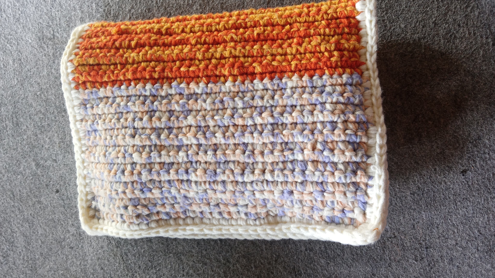
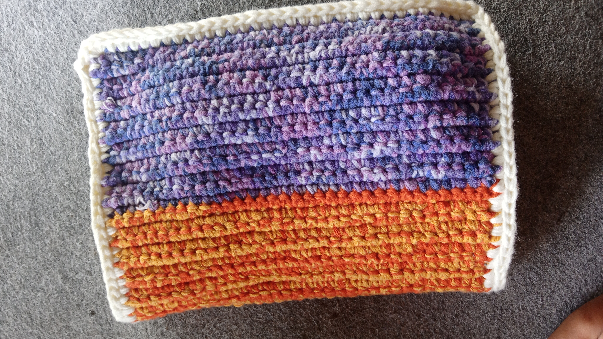
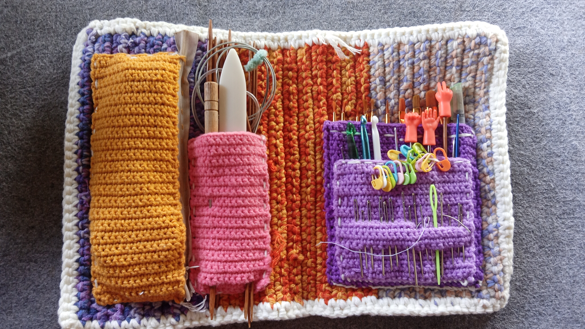

Hellooooooo

Lama tak jumpa. 

Aku banyak membuat barang-barang selama nggak banyak nulis. Entah kenapa saat diluar sedang ramai arus lebaran dna merayakan selesainya bulan ramadhan, aku merasa sangat sedih. Jadi demi menutupi kesedihan itu, aku banya membuat barang-barang. Nggak sepenuhnya berguna, tapi menurutku proses membuat sesuatu itu membuatku tenang. 

Salah satu buatanku yang berguna adalah *craft tools organizer*. Karena aku bisa crochet dan kebetulan ada benang yang ingin aku pakai untuk barang yang lebih manfaat, jadi aku buat dengan merajut benang-benang sisa. 

Benang yang warna-warni ga jelas inilah yang jadi alasan pertama, kemudian aku punya benang orange dan kuning yang sebenarnya sudah jadi tas untuk botol minum. Karena aku jarang juga bawa botol minum doang, akhirnya aku memutuskan untuk menggunakannya di barang yang lebih sering aku gunakan. Karena sedih juga kalau sudah susah-susah membuat sesuatu tapi jarang digunakan. 

Aku membuat ini dengan menggabungkan 3 helai benang sekaligus saat merajut, jadi hasilnya lebih tebal daripada rajutan yang hanya menggunakan satu helai benang saja. Aku juga suka hasil jadinya yang kaku, karena kan akan dipakai untuk menampung banyak barang. Karenanya, meskipun benang awalnya ada banyak, aku masih harus membeli benang baru untuk melanjutkan project ini. Akhirnya aku membeli benang sembur ungu ini.

Bagian *base* project ini terdiri dari 2 jenis benang yang berbeda, yang putih sembuh nggak jelas itu full akrilik, yang orange dan ungu dan border putih itu dari benang milk cotton. Jujur aku lebihh suka tekstur yang milk coton, ketebalannya juga menurutku lebih teratur yang milk cotton karena entah kenapa benang akrilik itu banyak ynag jendol-jendol gitu wkwkw

Anyway, mereka tetap bagus barengan. 

Jadi, mereka bertiga menjadi rumah untuk kantong-kantong ini. Dua kantong ungu untuk kuas cat air dan *hook* rajut serta jarum-jarum jahit. Kantong pink untuk jarum rajut knit dan *bone folder* dan *awl* untuk *bookbinding*. Kantong kuning untuk berbagai keperluan lain, seperti cutter, gunting, pengaris kecil, dan lainnya. Satu kantong ini nyaris mengandung semua hobiku hehehe

Saat membuat ini, aku sadar kalau hobiku adalah membuat sesuatu. Menulis, merajut, menjilid buku, menjahit, dan mengggambar (ini masih belajar sih, but okay lah ya). Bahkan saat aku sedang merasa sangat sedih seperti kemarin pun aku lari ke membuat sesuatu untuk melupakan kesedihanku.

Yah..... pada akhirnya demikian. Dengan selesainya project ini, aku memulai banyak project lain. Sekarang sudah banyak yang selesai sih, tapi akan aku tulis sedikit-sedikit, karena aku juga masih perlu bekerja hehehehe

Sekian cerita tentang tempat penyimpanan hobi-hobiku hehehehe 

Love you, hope you have a good great day!