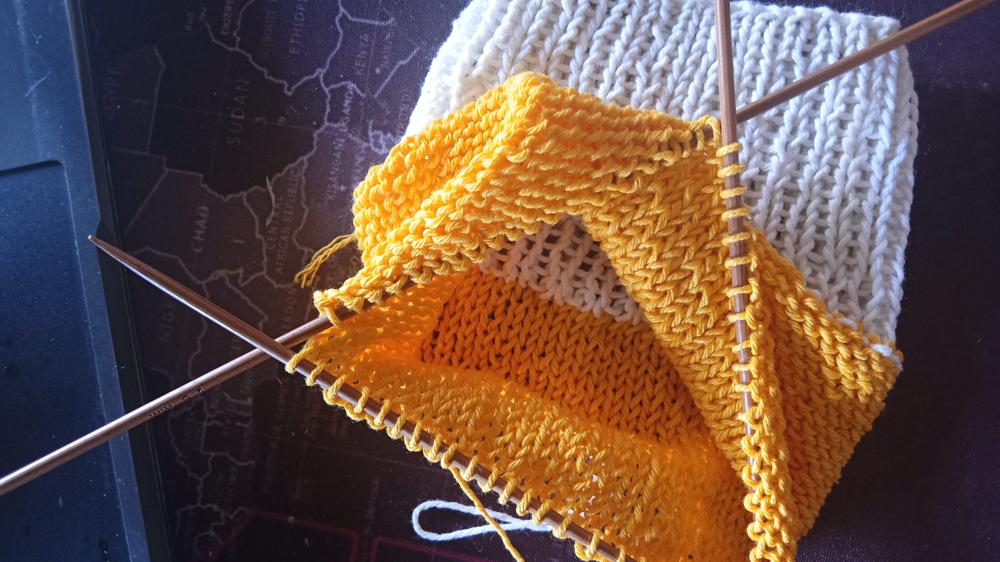

## Hello

I feel like it is such a long time that I didn't pick up my knitting needle and actually knit some stuff. My mental 
health is going downward nowadays due to my period (*that* period). So I decided to do the thing that every girls do: distract myself. I pick up knitting to just forget about my dangerous mind. 

I don't have a lot of yarn in hand, but I do have some projects that I wanted to do. Try to make proper sock is number one in that list. So, I downloaded some youtube videos (because I hate ads) about knitting socks and do it right away. This is the video that I will use most of the times:



Actually I started yesterday and make some good progress today.

## 2025.02.17 Day 2 - How it feels knitting in round with DPN

Still kinda nervous and afraid of me poking my eyes with the needles. Hehehhee

But fair enough I never did that. 

I use small ply cotton yarn in the color of white and yellow. Those are leftover yarns from my bouquet projects. I guess those small balls of yarn will be enough to make one sock. That's why it is not socks, but sock. I just planned to make one sock hehehe

Actually, it's helping me a lot with the suicidal thoughts. I just think about how much more rows I need to knit. Do I need to follow the excact pattern or just came up with my own?

I don't know. I just knit and enjoy the process.

It is night enough to write and knit, so I'll just prepare to sleep. Good night.

## 2025.02.19 Day 3 - Frogged

Yea....... I am confused by the way the lady explain things. So, I frogged the project at this point: 

Nevertheless, I am not give up for sock!!!!

I quickly look up for another pattern and [this pattern](https://www.lovecrafts.com/en-gb/p/simple-socks-with-short-row-heel-and-toe-knitting-pattern-by-dorothy-shaw) came out like magic. So I started to knit this pattern.

## 2025.02.20 Day 4 - What do I know

Honestly at this point, what do I even know about anything?????

I stuck at the heel part because I don't know a slightest about short row thing. Maybe I shouldn't frogged the project that fast.....

Or maybe I can just learn what and how is the short row thing??????

I have plenty of time anyway.

Yes, you encountered how an ENFJ brain works.

## 2025.02.21 Day 5 - Well,.... I can explain

Actually, I cannot explain anything at this point. I have no explanation. I just feel.... not right.

I frogged again. hahahahhahaha

It's not that funny, tho. Because it is sad to starting all over again. But I really found the most vanilla sock ever. It is short. And... I did like the pattern. 

I know the size is not for me, but at least I can try to...... make it??????

Yeah, I just frogged it and call it a day when it is just half way.

Let's just wait for tomorrow. Hopefully I am not on my frogged era again.

## 2025.02.22 Day 6 - Congratulations!!!!!!!

Hahahahha I am referring to the Korean Band, Day6. They have song titled "Congratulation". This night, I finished my first sock!!!!!!!!!!!!!!

I didn't take a photo of the finished project, but I have the urge to just write the feelings down here. So here I am!!!!

I am really happy about the sock. I want to make another one with some leftover yarns that I have or just frogged some projects........ 

HAHAHHAHA

It is super vanilla sock, but I really love it!!!! 

Actually, I cannot wear this one because it is too small for me, so I really want to make a pair that I can actually wear. 

Maybe I should buy some yarn?????? Hehehhehehehhehehehehhehehrhhehehrhrhrhhehehehehhehehehe

Okay, I need to stop thinking about this knitting things because it is making me crazy right now :sob:

I'll attach the pic tomorrow. 