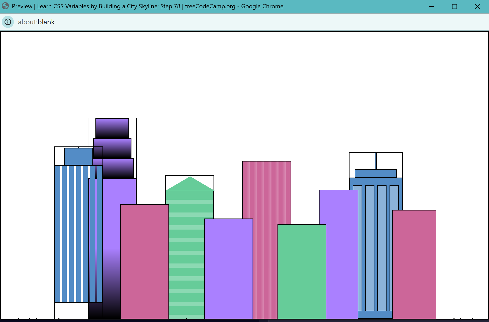
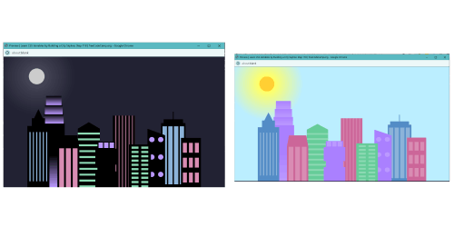
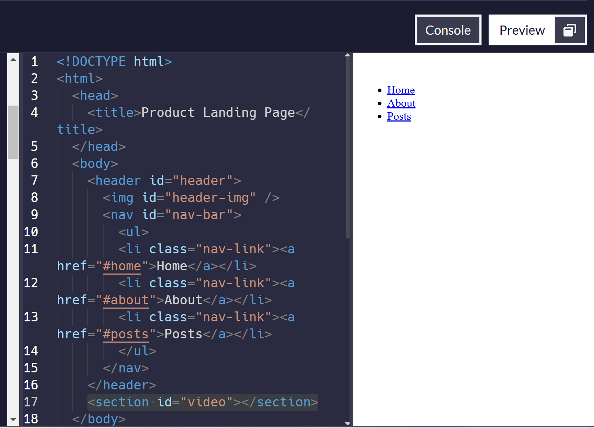
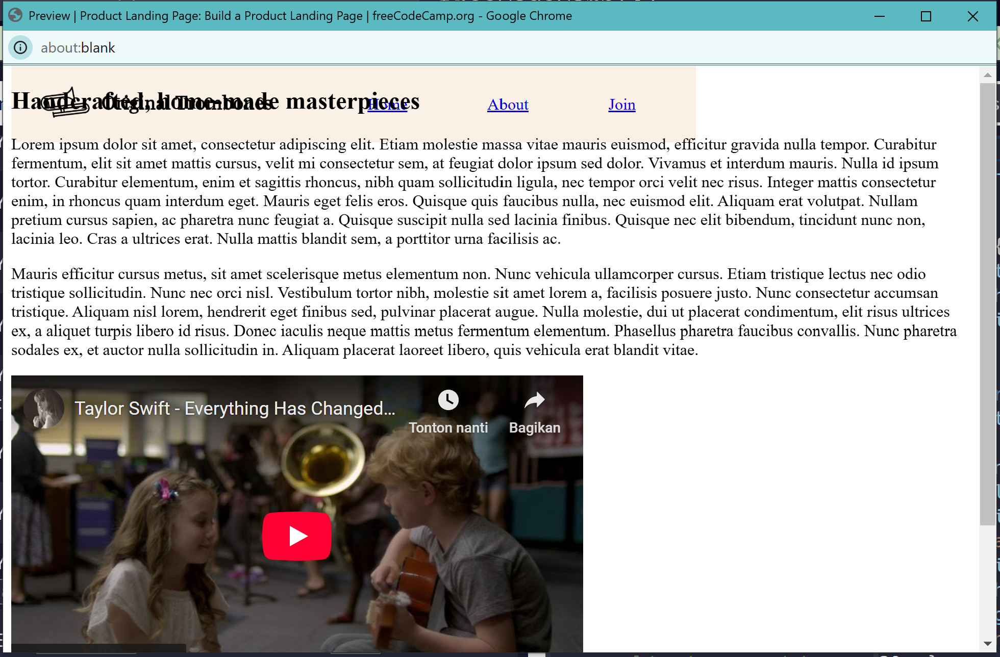
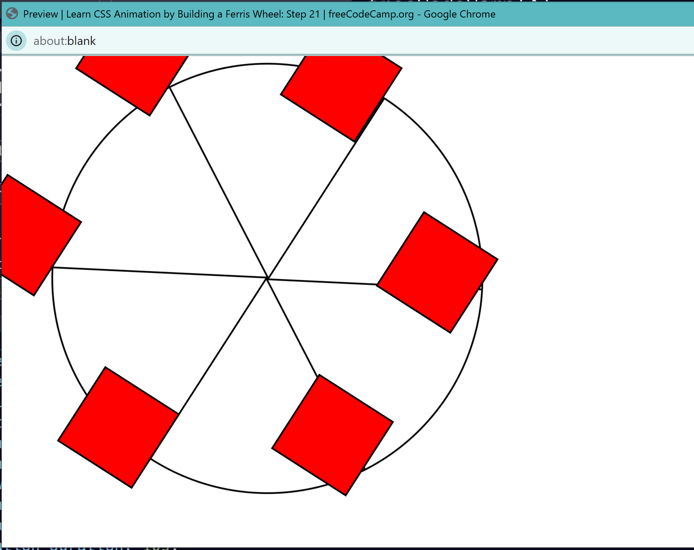

Ceritanya aku mau seriusin lagi belajar koding dari awal. Aku sudah tahu website ini jauh sebelum aku daftar di website ini. Tapi mari ceritakan hal-hal yang bisa dilihat oleh orang lain yah....

Menurut [profilku di freecodecamp](https://www.freecodecamp.org/satriafii), aku daftar website ini April tahun 2021. Selama nyaris 4 tahun ini aku bolak-balik di website ini, sempat konsisten selama 9 hari berturut-turut mengerjakan latihan koding disini. Tapi itupun belum bisa sampai menyelesaikan sertifikasi apapun. Saat ini aku masih belajar Responsive Web Design karena itu yang menurutku paling aku butuhkan. Setidaknya dalam waktu dekat aku ingin benar-benar paham bagaimana cara membuat website.

Meskipun aku sudah punya website sendiri seperti ini, tapi rasanya akan lebih afdol kalau aku juga tahu bagaimana orang membuat website dengan wordpress, blogspot, dan berbagai cara lainnya. Mulai dari situ, aku bisa melangkah lebih lanjut lagi ke berbagai macam jenis hal menarik lainnya. 

Jujur saja sampai disini aku masih kurang tertarik untuk kerja di bidang pembuatan website dan semacamnya. Buatku ini masih sekadar hobi saja. Meskipun aku nggak terlalu pintar, sejak dulu aku sangat kagum dengan programmer dan developer, jadi saat ada kesempatan seperti ini, aku gunakan untuk setidaknya mencoba belajar apa yang pernah mereka pelajari.

Yap, mulai agak ngawur lagi, berarti inilah saatnya untuk to the point.

Laman ini aku gunakan untuk menulis curhatan kecil dan hal-hal kecil apapun yang aku pelajari dari [freecodecamp](https://www.freecodecamp.org/). Semoga saja bisa setiap hari absen. Kalau-kalau tidak setiap hari, artinya... life, bro. life. sometimes it hits.

### 2025-02-20

What I learned today:
- Kalau mau menambah class di HTML, tambahkan spasi diantara dua kelas saja. Tidak perlu pakai koma.
- Found out that simple press at F11 can make me more focused doing the learning thing instead of trying to search for answers. It is basically just me setting up the full screen thing.
- untuk membuat pola seperti zebra (strip-strip) dengan gradient supaya lebih natural, pakailah `repeating-linear-gradient`
- at this point, aku masih merasa belajar ginian kurang berguna buatku dalam jangka waktu pendek. Karena jujurly aku lebih suka warna dan penataan yang simpel-simpel aja hehhee But let's just learn it because it is fun!
- Step 54 City Skyline cuma copas aja wkwkkw
- memutuskan untuk udah dulu di step 78 karena mau lanjut baca buku hehehe 

Progress hari ini:

### 2025-02-21

Hehehehehhehe I did the lesson last minute(?) Hehehehhe

Tadi pagi udah ngerjain satu atau dua step gitu, aku lupa. Malam ini aku ngebut nyelesaiin City Skyline.

Things I learned along the way:
- I still confused with the `flex` thing. I don't know how to control them......
- I really like the concept of `var` hehehe.
- I posted on forum!!!!! Hehehhehehehe

Hari ini aku ngerasa sangat kesepian dan nggak ada interaksi apapun dengan manusia beneran. Jadi poin ketiga itu sangat signifikan buat aku.

Mahakarya hari ini:

### 2025-02-22

Mulai project baru: Magazine.

Tiap kali memulai project baru aku harus: melihat bagaimana cara memulai HTML wkwkwk 

What I learned today:
- `hr` element is used to make blockquote more beautiful hehe and set that aside from the rest of the other text. And the best of all it is just `
` saja
- to add fallback on `font-family`, all you need to do is just add comma before the fallback. 
- Actually, I don't know what fallback font is........
- the `grid-template-columns`, I was familiar with this, but I don't know about `minmax`. If this `minmax`-thing can make the appearance more responsive, I should try change something in my [photos](/photos/) page hehehe
- `place-items` ini intinya `align-items + justify-items` kan????

btw ini udah 94% to go~ 

AAAAANNNNDDD done at 10:11 AM

Lalu ngintip certification project nya hehehehe tinggal dua serifikasi lagi btw. Tapi sejauh ini aku ngerasa belum tahu apa-apa :sob: :sob: :sob: :pray:

### 2025-02-23

Entah kenapa seharian ini tadi aku capek banget dan cuma pengen baca buku dan goleran aja. Jadi, aku memutuskan untuk tidak terlalu membuka laptop dan akan buka laptop kalau udah mau mengerjakan freecodecamp aja. Hasilnya ini udah mau jam tidurku, aku baru buka laptop dan beburu mengerjakan sedikit certification project. Progress hari ini:

### 2025-02-24

Sudah selesai wkwkwkwkwkkw

Memalukan sih ini. Bentukannya ga karuan, mana masih nyontek sana sini buat nyelesaiinnya. 

Kodingannya berantakan banget, malu banget :sob: :sob: :sob:

87 line html dan 40 line css wkwkwkwkwkwkwkwkwkkwkw demi sertifikasi doang. Ini ibarat ujian emang cuma ngejar kkm aja, ga peduli bentukannya kek mana. Jungkir balik ga karuan.

Well, at least I did it.......

Tinggal dua project dan satu sertifikasi lagi sih ini, langsung bisa officially claim certification untuk Responsive Web Design di freecodecamp.

Abis ini bikin ferris wheel, btw. Kalau hari ini mood ya hari ini dikejar, kalau nggak ya mungkin besok ajah ehehheeh

Tapi jujurly ini project-project sertifikasi di freecodecamp bisa aku remake tanpa harus ada id dan classes yang udah ditentukan. Mungkin besok kalau udah lancar ngodingnya sih. 

YAALLAH ternyata bisa dilihat di public profile code ku huhuhuhuhhu malu banget

### 2025-02-25

Sampai malam aku belum ngerjain apapun. Tapi ini aku mau ngerjain sambil nunggu sesuatu. Hehehehhe

Semoga dapat agak banyak :") wkwkkw

Lumayan dapet agak banyak hari ini ehehehe. Progress hari ini: 

Ini sudah bisa gerak btw, aku belajar tentang animation dan keyframes, sekilas saja sih, sesuai penjelasan waktu ngerjain step 18. 

Terus ternyata bisa bikin beberapa bentuk yang sama dengan `:nth-of-type(n)`. Konsep ini dipake buat bikin garis jari-jari dan kotak-kotak merahnya.

### 2025-03-01

Wah, akhirnya baru bisa melanjutkan membuat ferris wheel hari ini. Abis sahur memang enaknya bergelut dengan CSS :wink:

Lumayan bisa menyelesaikan per-CSS an itu hari ini. Aku belajar tentang animation dan cara membuatnya lebih menarik lagi dengan sesimpel mengubah background color aja. 

Oh aku juga belajar tentang `keyframes`.

Sejujurnya, aku belajar banyak bahkan dari sesi sependek sepuluh menit ini.

Tapi... I feel like I don't understand anything :sob::sob::sob:

....

Yasudahlah~