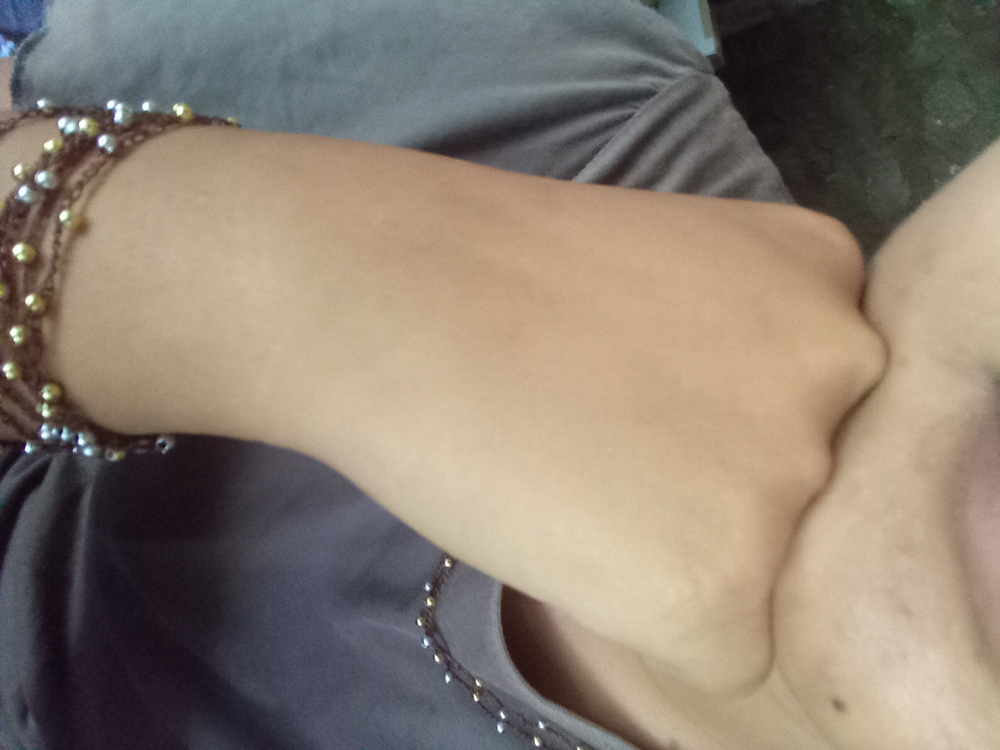
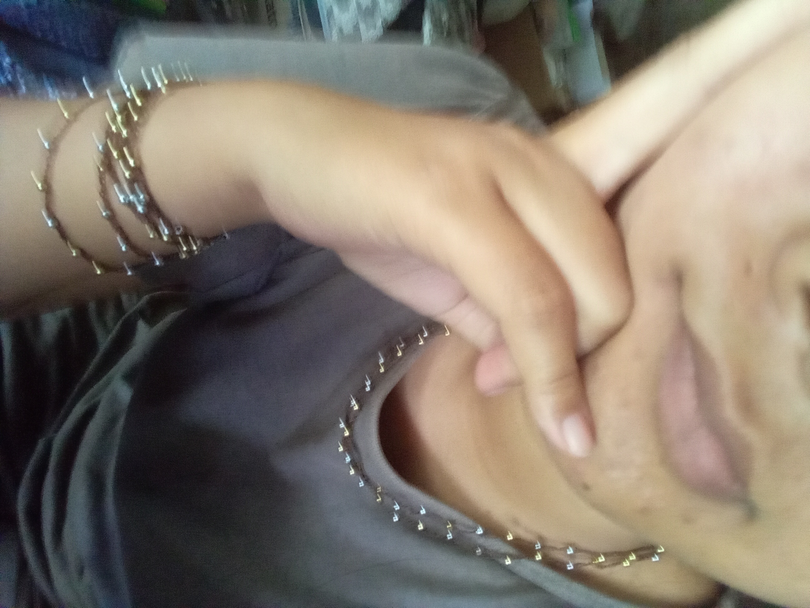

Helloooooooooo

Another day talking about another project. Now, it is a really small project. I used nylon yarn that I have from long time ago and some little tiny beads that I also have from long time ago. Both I bought without any a in mind. I used the yarn mainly for bookbinding due to its strong grip on paper. But sometimes working with it is a little bit tricky because it will ripped off thin paper.

I want to used up the yarn/thread as useful as possible, so I looked for micro crochet project to work on.

I found this tutorial and use both of the materials that I already have:



The result are amazing!!!!! I really love the look of it. And I have a lot of outfit to go along with it because the color is basically my color pallete too. I am really happy with this project.

The process of making this bracelet/necklace also really easy and basically just chaining all over. I used hook number 1/0 that I also have from long time ago. The hook size is really perfect for this project. 

Some pics of me wearing this bracelet and necklace (I made two of them, by the way).

The photos are a little bit blur, but somehow I like the effects. It is unintentional, but for me it's like some stars wrapping my hand and neck hehehe

The ammount of time me making this bracelet is surpisingly realy fast, I can make tens of these in a day, because it is so easy to make.

Anyway, this is my first step of my journey to crochet jewelry.

Hope you have a good great day today!!

Love,
Satriafii