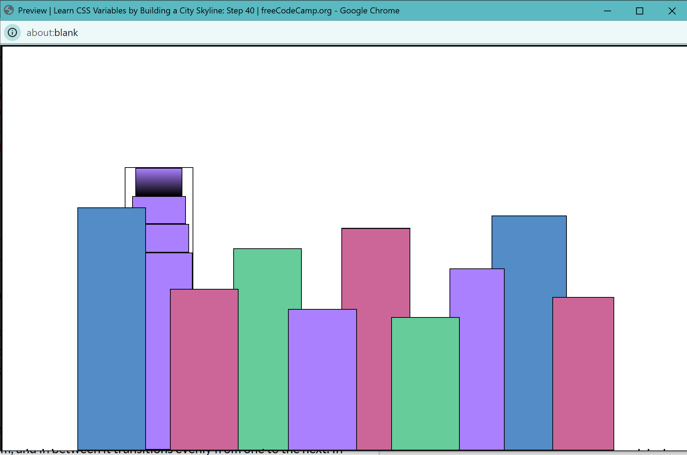

Barusan ngerjain beberapa kode di freecodecamp.org hehehe. And found out that I **always** need to add `var` sebelum menyebut nama warna yang diinginkan. Stuck disini tadi selama 5 menitan. But worth learning! 

Aku stuck [disini](https://www.freecodecamp.org/learn/2022/responsive-web-design/learn-css-variables-by-building-a-city-skyline/step-40) lalu nyari [solusi disini](https://forum.freecodecamp.org/t/background-property-linear-gradient-value-usage/511716) tanpa sadar kalau sudah ada jawabannya. Begitu sudah bener kodingannya, baru sadar kalau ada yang udah jawab bener wkwkwk

Sampai disini membangun city skyline nya:

